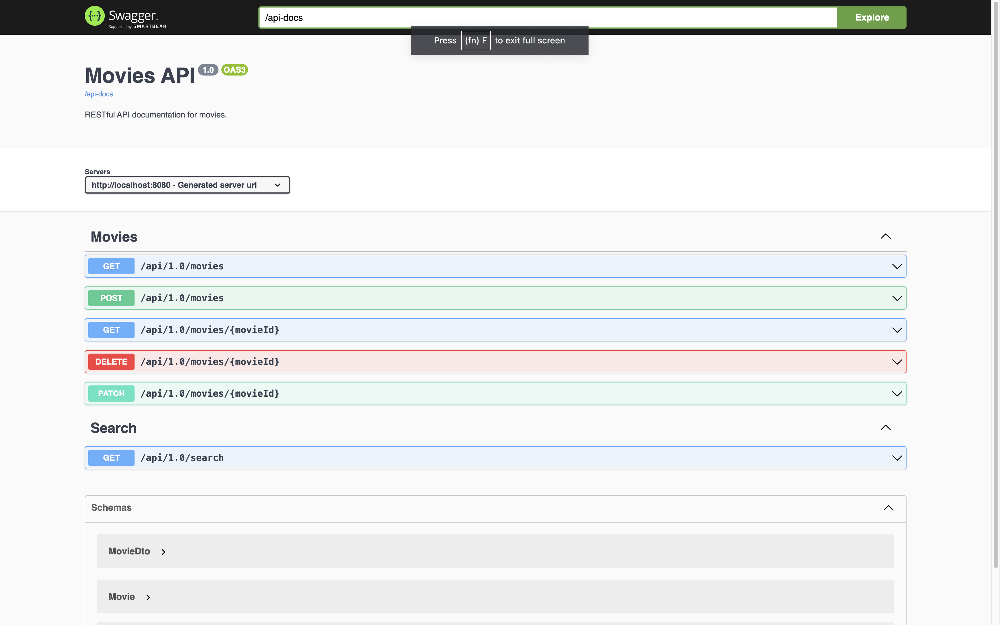

# Testing Spring Boot RESTFul API

Example code that demonstrates how to test RESTFul API in spring boot using Mockito, MockMVC.

#### Movies API Docs:

The Swagger UI page is available at http://localhost:8080/swagger-ui/index.html and the OpenAPI 
description is available at http://localhost:8080/api-docs.

